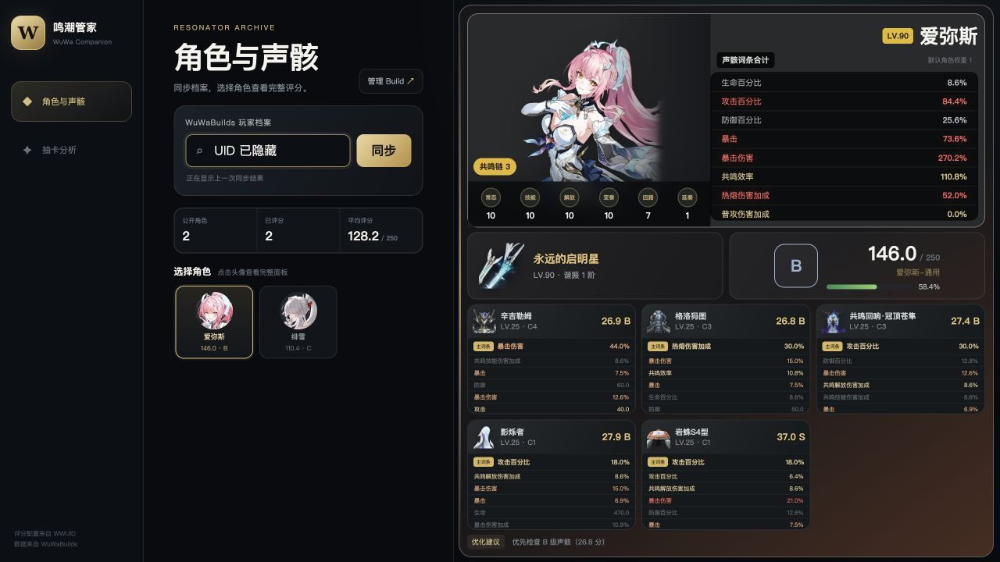
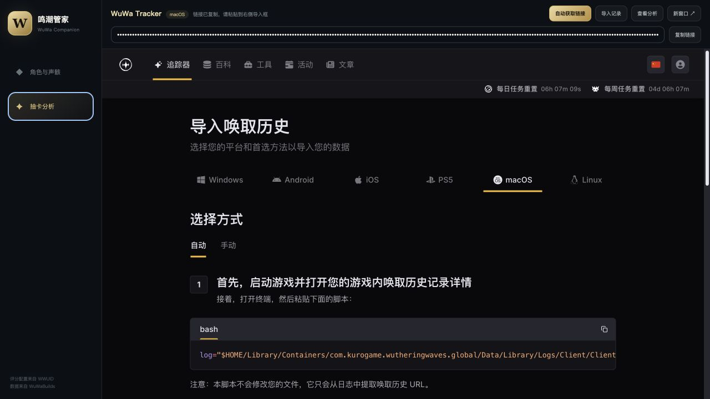

# WuWa Companion

跨平台的本地鸣潮养成助手：同步 WuWaBuilds 角色档案，按 WWUID 配置评分声骸，并在同一页面使用 WuWa Tracker 查看抽卡分析。

## 界面预览

### 角色与声骸评分



### 抽卡链接提取与 WuWa Tracker



## 功能

- 通过 UID 同步 WuWaBuilds 公开角色 Build
- 展示角色、武器、技能、面板和五件声骸
- 按国内 WWUID 评分配置标记有效词条、声骸等级和优化目标
- 对比前后两次同步的评分、武器和声骸变化
- 自动检查 WWUID 上游评分配置版本并提示更新
- 在 macOS 上自动遍历声骸仓库，通过系统 Vision OCR 识别主副词条并评分
- 支持首件预检、实时扫描进度、中断结果保留及本地库存 JSON 导入导出
- 自动识别 Windows、macOS 和 Linux 的常见游戏路径，提取抽卡链接
- 内嵌 WuWa Tracker 导入与抽卡分析页面
- 纯 Node.js 和原生 Web 实现，无 npm 运行时依赖

## 快速开始

需要 [Node.js 20+](https://nodejs.org/)。

```bash
git clone https://github.com/ddddyyyy/wuwa-companion.git
cd wuwa-companion
npm start
```

浏览器打开 [http://127.0.0.1:4173](http://127.0.0.1:4173)。服务只监听本机地址。

## 使用方式

### 角色与声骸

1. 在 [WuWaBuilds](https://wuwa.build/import) 维护并公开角色 Build。
2. 在 WuWa Companion 输入游戏 UID 并同步。
3. 选择角色，查看面板、声骸评分和优化建议。

### 抽卡分析

1. 在游戏中打开一次“唤取记录”。
2. 进入侧栏“抽卡分析”，应用会自动查找并复制抽卡链接。
3. 将链接粘贴到内嵌的 [WuWa Tracker](https://wuwatracker.com/zh-CN/tracker) 导入页。

如果自动查找失败，页面会显示当前系统对应的官方导入教程。

### macOS 声骸仓库扫描

1. 使用简体中文客户端，将游戏设为全屏或无边框。
2. 打开“背包 → 声骸”并滚动到顶部。
3. 进入“声骸仓库”，先检查权限并预检第一件声骸，确认识别正确后再开始全量扫描。数量留空时会从游戏界面自动识别。

扫描过程会实时保存已完成的声骸；按 Esc 或遇到识别异常时，已完成部分仍会回到本地库存。导出的 JSON 可以在另一台设备上重新导入。

首次扫描需在 macOS 授予“屏幕录制”和“辅助功能”权限。扫描器使用系统 ScreenCaptureKit 与 Vision，不读取游戏进程内存；首次使用会通过 `swiftc` 编译本地辅助程序，因此需要 Xcode Command Line Tools。

## 数据与隐私

- WuWaBuilds 数据通过其公开 API 读取，每次点击同步都会获取最新 Build。
- 抽卡链接只从本机日志读取、返回给本地页面并尝试复制到剪贴板，本项目不会将其写入磁盘。
- 抽卡数据由 WuWa Tracker 管理；向其粘贴链接时适用 WuWa Tracker 的隐私政策。
- 声骸扫描只截取本机鸣潮窗口，识别结果保存在浏览器本地存储中。
- 本项目不需要游戏账号密码，也不会修改游戏文件。

## 开发

```bash
npm test
```

更新固定版本的 WWUID 评分配置：

```bash
npm run sync:wwuid
```

普通用户启动时会检查 GitHub 上的 WWUID 版本；发现新版后可点击侧栏按钮主动更新。更新失败会自动恢复原配置。评分参考和第三方许可见 [NOTICE](NOTICE.md)，设计说明见 [docs/build-card-echo-scoring-design.md](docs/build-card-echo-scoring-design.md)。

## 许可与声明

项目以 [GPL-3.0](LICENSE) 许可发布。本项目是非官方玩家工具，与库洛游戏、WuWaBuilds、WWUID 和 WuWa Tracker 均无隶属关系；游戏素材与商标权利归其各自权利人所有。
