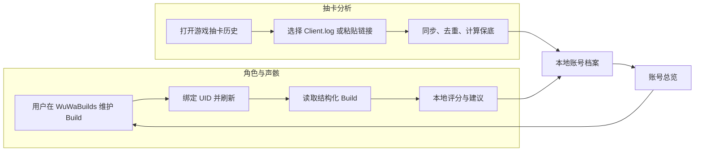

# WuWa Companion：WuWaBuilds 声骸评分与抽卡分析设计

状态：实现中
目标平台：Windows、macOS、Linux
文档版本：1.4（2026-08-12）

## 1. 目标

这是一个跨平台本地“鸣潮账号管家”。WuWaBuilds 是角色 Build 的唯一数据源，用户在 WuWaBuilds 上传和维护 Build，本应用完成：

1. 用户绑定 WuWaBuilds UID 后，读取其公开的角色、武器和五只声骸数据。
2. 按国内社区常用的角色权重计算单件分与整套分。
3. 给出 `C / B / A / S / SS / SSS` 评级。
4. 解释每条属性贡献，并指出最需要替换的声骸。
5. 从用户选择的 `Client.log` 提取临时抽卡历史链接，同步并合并记录。
6. 展示各卡池当前垫数、保底状态、五星历史和基础统计。
7. 将 WuWaBuilds 缓存与抽卡记录放在同一个本地账号档案中。

本应用不导入图片、不做 OCR，也不提供 Build 编辑器。用户需要更新装备时，前往 WuWaBuilds 重新导入或维护，然后回到本应用点击“刷新”。评分仍在本地完成；抽卡模块只访问游戏官方抽卡历史接口，不读取账号密码。

## 2. 第一版范围

### 包含

- 输入 UID 或粘贴 WuWaBuilds Profile 地址绑定账号。
- 从 WuWaBuilds 读取该 UID 的公开 Build 列表和完整声骸字段。
- 每个角色默认使用 WuWaBuilds 上时间最新的 Build。
- 单件及整套声骸评分。
- 主词条、套装、COST 和最低共鸣效率检查。
- 评分贡献明细及替换建议。
- 缓存最近一次成功读取的远程 Build，供离线查看。
- 一键打开对应的 WuWaBuilds Profile、Build 和导入页。
- 用户主动刷新，成功后五分钟内复用本地缓存。
- 用户手动选择 `Client.log`，应用记住文件访问权限。
- 从日志提取最新的临时抽卡历史链接，或由用户粘贴链接。
- 拉取、去重并增量合并各卡池历史。
- 当前垫数、保底状态、五星平均抽数和五星历史。
- 原生 JSON 导入、导出与本地备份。

### 不包含

- 背包中未装备声骸的扫描与评分。
- Build Card 图片导入、OCR 和截图校对。
- 在本应用新增、修改或删除 WuWaBuilds Build。
- 自动操作 Discord 或向 WuWaBuilds 提交图片。
- 云端账号、云同步和排行榜。
- 完整队伍循环伤害模拟。
- 任意尺寸、裁剪图片或游戏内截图识别。
- 自动操作游戏、自动打开抽卡历史页或后台常驻监控日志。
- 抽卡规划、原石预算、概率模拟和“欧非”排行榜。
- 多设备云同步或远程账号登录。

以上能力在第一版验证稳定后按实际需求增加。

## 3. 用户流程



应用侧边栏只有四项：`总览 / 角色与声骸 / 抽卡分析 / 设置`。远程 Build 缺少字段或抽卡历史不完整时明确标记，不显示伪精确结论。

## 4. 技术方案

使用浏览器界面和本机 Node.js 服务，不增加远程服务：

| 能力 | 实现 |
|---|---|
| 界面 | 原生 HTML、CSS、JavaScript |
| 本机服务 | Node.js 20 内置 `http` 与 `fetch` |
| WuWaBuilds 数据 | 本机服务请求 `https://api.wuwa.build` 的 JSON |
| Build 入口 | UID 或 `https://wuwa.build/profile/{uid}` |
| 数据模型与规则 | JavaScript + JSON |
| Build 缓存 | 浏览器 `localStorage` + 本机五分钟内存缓存 |
| 网页入口 | 系统浏览器打开对应 WuWaBuilds 页面 |
| 抽卡日志访问 | 浏览器文件选择器，由用户主动选择 |
| 抽卡接口访问 | Node.js `fetch`，仅允许 HTTPS 官方域名 |
| 敏感信息 | 不采集账号密码，不持久化临时抽卡 URL |

第一版不使用数据库。只有当 Build 与抽卡记录的浏览器存储出现可测量瓶颈或需要复杂跨账号查询时，才迁移 SQLite。

模块保持为直接的数据流，不增加服务端：

```text
WuWaBuildsClient UID → RemoteBuild
BuildNormalizer  RemoteBuild → Build
EchoScorer       Build + 角色权重 → ScoreResult
BuildCache       缓存最近一次成功读取的 Build

ConveneImporter  Client.log/粘贴 URL → PullRecord
ConveneAnalyzer  PullRecord + 卡池规则 → PullSummary
PullStore        合并、保存和导出抽卡历史
```

不为它们增加接口、工厂或插件系统。

## 5. WuWaBuilds Build 同步

### 5.1 绑定方式

- 接受 9 至 10 位数字 UID。
- 接受 `https://wuwa.build/profile/{uid}`，应用只提取其中 UID。
- 不要求 WuWaBuilds 登录态、Cookie 或用户密码。
- 绑定只代表读取该 UID 已公开提交的 Build，不验证 UID 所有权。

绑定后保存 UID；用户更新 Build 时仍然回到 WuWaBuilds 操作。

### 5.2 当前数据协议

当前 WuWaBuilds 前端使用以下公开 JSON 读取数据：

```text
GET https://api.wuwa.build/profile/{uid}/builds?page=1&pageSize=50
GET https://api.wuwa.build/build/{buildId}
```

列表响应提供 `buildId`、角色、武器、总属性、`echoSummary`、CV 和时间；详情响应额外提供 `buildState.echoPanels`，包含五只声骸的 ID、等级、主词条、副词条和套装 ID。

同步步骤：

1. 分页读完 UID 的 Build 摘要，页数以响应中的 `total` 为准。
2. 按 `character.id` 分组，以 `timestamp` 选择每个角色最新 Build。
3. 请求这些 Build 的详情；用户查看旧 Build 时再按需请求详情。
4. 将 `echoSummary.mainStats[i].cost` 与 `buildState.echoPanels[i]` 合并为第 `i` 只声骸。
5. 归一化远程英文属性名，执行字段与合法值检查。
6. 成功后原子更新本地缓存并重新评分。

WuWaBuilds 目前没有公开的版本化 API 文档，因此只将协议适配集中在 `WuWaBuildsClient` 和 `BuildNormalizer`，不让远程字段名进入评分器。

### 5.3 同步与失败规则

- 仅请求 `https://api.wuwa.build`，拒绝跨域重定向。
- 每个 Build 以远程 UUID 为唯一键；重复刷新不产生副本。
- 第一版不轮询；用户主动刷新，距离上次成功同步不足五分钟时直接使用缓存，避免无意义请求。
- 列表成功但详情失败时保留上一次缓存，并显示最后成功刷新时间。
- 远程 Build 被删除时从“当前 Build”移除；已缓存结果仅标为“远程不可用”，不允许本地编辑后冒充远程版本。
- 详情不是恰好五只声骸、主副词条缺失、数组顺序不一致或出现未知字段时，该 Build 显示“暂不可评分”。
- API 格式改变时显示“WuWaBuilds 数据格式已变化，请更新应用”，不回退到 OCR 或网页 HTML 抓取。

远程属性归一化示例：

```text
Crit Rate → 暴击
Crit DMG → 暴击伤害
Resonance Skill DMG Bonus → 共鸣技能伤害加成
Energy Regen → 共鸣效率
```

## 6. 数据模型

### 6.1 已同步 Build

```json
{
  "schemaVersion": 1,
  "source": {
    "kind": "wuwabuilds",
    "buildId": "9643ba72-1b42-43df-90a4-003a47b1cfa9",
    "remoteTimestamp": "2026-08-12T04:00:00Z",
    "fetchedAt": "2026-08-12T12:00:00+08:00"
  },
  "player": {
    "uid": "701234567",
    "name": "玩家名"
  },
  "character": {
    "id": "1304",
    "name": "今汐",
    "attribute": "衍射",
    "level": 90,
    "sequence": 0
  },
  "weapon": {
    "name": "时和岁稔",
    "level": 90,
    "rank": 1
  },
  "echoes": [
    {
      "slot": 1,
      "name": "角",
      "cost": 4,
      "level": 25,
      "sonata": "浮星祛暗",
      "mainStats": [
        { "name": "暴击伤害", "value": 44.0, "unit": "percent" },
        { "name": "攻击", "value": 150, "unit": "flat" }
      ],
      "subStats": [
        { "name": "暴击", "value": 10.5, "unit": "percent" },
        { "name": "暴击伤害", "value": 21.0, "unit": "percent" },
        { "name": "攻击%", "value": 8.6, "unit": "percent" },
        { "name": "共鸣技能伤害加成", "value": 9.4, "unit": "percent" },
        { "name": "共鸣效率", "value": 8.4, "unit": "percent" }
      ]
    }
  ]
}
```

WuWaBuilds 详情提供可变主词条；若评分需要 COST 固定的第二主属性，只能根据已确认的 `COST + 等级` 规则推导。无法确定时不补值。

### 6.2 远程数据问题

```json
{
  "path": "echoes[1].subStats[2].value",
  "severity": "error",
  "remoteValue": 8.8,
  "message": "WuWaBuilds 返回值不在当前已知词条档位中"
}
```

`severity` 只使用：

- `warning`：仍可评分，但结果页显示来源问题。
- `error`：当前 Build 无法评分，引导用户打开 WuWaBuilds 检查或稍后刷新。

应用不提供本地修改入口，避免本地数据和 WuWaBuilds 产生两个真相源。

### 6.3 角色评分配置

```json
{
  "schemaVersion": 1,
  "weightsVersion": "2026.08",
  "characterId": "1304",
  "characterName": "今汐",
  "templateId": "general",
  "templateName": "通用",
  "mainWeights": {
    "4": {
      "攻击": 0.025,
      "攻击%": 0.275,
      "暴击": 0.5,
      "暴击伤害": 0.25
    },
    "3": {
      "攻击": 0.025,
      "攻击%": 0.275,
      "属性伤害加成": 0.275
    },
    "1": {
      "攻击%": 0.4
    }
  },
  "subWeights": {
    "攻击": 0.1,
    "攻击%": 1.1,
    "暴击": 2.0,
    "暴击伤害": 1.0,
    "技能伤害加成": 1.1,
    "共鸣效率": 0.25
  },
  "skillWeights": {
    "普攻伤害加成": 0,
    "重击伤害加成": 0,
    "共鸣技能伤害加成": 0.65,
    "共鸣解放伤害加成": 0.30
  },
  "maxScoreByCost": {
    "1": 76.254,
    "3": 79.804,
    "4": 83.804
  },
  "gradeThresholds": [0, 0.48, 0.60, 0.70, 0.78, 0.84],
  "minimumEnergyRegen": 120,
  "allowedSonatas": ["浮星祛暗"],
  "allowedMainStats": {
    "4": ["暴击", "暴击伤害"],
    "3": ["衍射伤害加成", "攻击%"],
    "1": ["攻击%"]
  }
}
```

配置随应用发版更新。每次结果必须记录 `weightsVersion` 和 `templateId`，避免规则更新后旧分数失去来源。没有角色专属配置时不回退通用分，而是显示“暂无专属评分”。

## 7. 评分算法

评分口径参考 WutheringWavesUID 的公开角色权重算法，但在本项目中独立实现。

### 7.1 单条属性

普通属性：

```text
属性原始分 = 属性数值 × 属性权重
```

技能伤害属性：

```text
属性原始分 = 属性数值 × 技能伤害通用权重 × 对应技能占比
```

角色属性伤害只在属性类型与角色一致时得分。例如今汐的衍射伤害加成有效，冷凝伤害加成为零分。

### 7.2 单件评分

```text
单件原始分 = 主属性贡献 + 固定主属性贡献 + 所有副词条贡献

单件分 = floor((单件原始分 / 当前 COST 理论最高分) × 50 × 100) / 100
```

显示分数限制在 `0...50`。配置错误造成超过 50 时记录诊断问题，不静默隐藏。

### 7.3 单件评级

```text
比例 = 单件原始分 / 当前 COST 理论最高分
```

从高到低匹配 `gradeThresholds`，对应：

| 比例 | 默认分数区间 | 评级 | 中文说明 |
|---:|---:|---|---|
| `< 0.48` | `< 24` | C | 建议替换 |
| `0.48...0.60` | `24...30` | B | 过渡 |
| `0.60...0.70` | `30...35` | A | 可用 |
| `0.70...0.78` | `35...39` | S | 优秀 |
| `0.78...0.84` | `39...42` | SS | 接近毕业 |
| `≥ 0.84` | `≥ 42` | SSS | 毕业级 |

表中为当前默认阈值，运行时以对应角色模板为准。

### 7.4 整套评分

```text
整套分 = 五只声骸单件分之和
整套比例 = 整套分 / 250
```

整套评级使用同一份比例阈值。远程数据缺少任意一只声骸时只显示可用信息，不生成整套评级。

## 8. 合法性与适配检查

评分和适配结论必须分开。高分不代表一定能装备或适合当前 Build。

### 硬错误

- 声骸总 COST 超过角色上限。
- 主词条属于其他元素伤害。
- 缺少必要主词条或 COST。
- 同一声骸出现重复副词条。
- 数值无法通过合法档位检查。

硬错误存在时不生成最终评级。

### 警告

- 套装不在角色推荐集合。
- 主词条可用但不是首选。
- 整套共鸣效率低于角色模板要求。
- 有效词条很高但关键属性明显失衡。

警告不修改数学分数，但结果页不能显示无条件的“毕业”。例如：

```text
数学评分：214.60 / 250（SSS）
适配结论：未达标
原因：共鸣效率 113.2%，低于模板要求的 120%
```

## 9. 结果与建议

结果页包含：

1. 角色、武器、评分模板和规则版本。
2. 整套分、评级与适配状态。
3. 五只声骸的分数和评级。
4. 每个主副词条的得分贡献。
5. 警告及远程数据问题。
6. “优先替换”建议。

优先替换规则保持简单且确定：

1. 先列出硬错误或主词条不匹配的声骸。
2. 其次列出当前分数最低的声骸。
3. 分数相同时，优先列出有效副词条更少的声骸。

第一版不生成“换成哪一只”，因为 WuWaBuilds Build 只包含当前装备，不是完整背包库存。

结果示例：

```text
今汐 · 通用模板 · 规则 2026.08

整套评分 216.43 / 250
数学评级 SSS
适配状态 达标

4C  43.80  SSS
3C  42.15  SSS
3C  37.20  S
1C  46.72  SSS
1C  46.56  SSS

优先替换：第 3 件 3C
原因：本套最低分，只有 3 条有效副词条
```

## 10. 抽卡分析

### 10.1 数据入口与刷新流程

第一次使用：

1. 用户在游戏内打开一次“唤取记录”，让客户端写入最新历史链接。
2. 用户在浏览器中选择 `Client.log`；应用只读取本次选择的文件，不猜测安装目录。
3. 用户点击“刷新抽卡”，应用只读日志并提取最新的候选 URL。
4. URL 通过安全校验后，应用按官方分页接口拉取各卡池记录。
5. 新记录按官方记录 ID 去重后写入本地；同步结束即从内存丢弃完整 URL。

无法选择日志时提供两个后备入口：粘贴临时 URL、导入历史 JSON。JSON 导入兼容本应用备份，并兼容已确认结构版本的 WuWa Tracker 导出；不能只凭文件名猜格式。

刷新不是后台自动任务。若 URL 已过期，界面只提示用户重新打开游戏内唤取记录，不要求重新导入已有历史。本地记录不会因官方接口不再返回旧数据而被删除。

### 10.2 URL 与隐私边界

抽卡 URL 带有临时鉴权信息，按敏感数据处理：

- 仅接受 `https`，Host 必须精确匹配随应用发布的官方白名单。
- 拒绝 IP 地址、localhost、非标准端口和跳转到白名单外域名。
- 完整 URL 不写入 JSON、日志、错误报告或剪贴板历史。
- 网络错误只显示已脱敏的域名、状态码和请求阶段。
- 不修改游戏配置文件，不读取账号密码，不上传抽卡历史。

### 10.3 抽卡数据模型

官方 ID 使用字符串保存，避免大整数精度丢失：

```json
{
  "schemaVersion": 1,
  "profile": {
    "uid": "123456789",
    "server": "cn"
  },
  "lastSyncedAt": "2026-08-12T12:00:00Z",
  "coverage": [
    {
      "poolGroup": "limited-resonator",
      "oldestAvailableReached": true
    }
  ],
  "pulls": [
    {
      "id": "opaque-official-id",
      "poolType": "official-pool-type",
      "poolGroup": "limited-resonator",
      "bannerId": "official-banner-id-or-null",
      "itemId": "official-item-id",
      "itemName": "角色名",
      "itemKind": "resonator",
      "rarity": 5,
      "pulledAt": "2026-08-12T19:30:00+08:00"
    }
  ]
}
```

- `id` 是去重主键；不使用“时间 + 名称”拼接主键。
- `poolType` 保留官方原值，`poolGroup` 用于判断哪些卡池共享保底。
- `coverage` 记录本次是否翻到接口当前可提供的最旧一页；它不代表已经覆盖账号创建以来的全部历史。
- 是否为当期 UP 由 `bannerId + itemId + 规则版本` 在分析时推导，不写死在历史记录里。
- 同一 UID 的导入采用集合并集；已存在记录不重复，旧记录不会被较短的新响应覆盖。
- 不同 UID 默认建立不同档案，禁止静默混合。

### 10.4 规则与计算

不同卡池使用随应用发布的版本化 `PoolRule`，至少包含：

```text
poolGroup
officialPoolTypes
rarityForPity
hardPity
featuredRule       none / guaranteed / missThenGuaranteed
carryAcrossBanners
```

规则不依赖中文卡池名称；游戏更新导致规则或卡池类型变化时，未知类型先显示原始记录，不套用旧规则。

核心计算：

1. **当前垫数**：同一 `poolGroup` 中，最近一次五星之后的记录数。
2. **保底状态**：根据该组最近一次五星、当期卡池目录及 `featuredRule` 推导。
3. **平均五星抽数**：只统计起点和终点都存在的完整五星区间。
4. **五星历史**：显示物品、卡池、时间、该次所用抽数和是否命中当期 UP。
5. **基础统计**：总抽数、五星数、完整区间平均值、命中次数和未命中次数。

结果必须带数据完整性：

- 最早记录之前可能还有抽卡且当前历史中没有五星时，显示“至少 N 抽”，不显示精确垫数。
- 无法确认上一个五星是否为当期 UP 时，保底状态显示“未知”。
- 缺少对应版本的卡池目录时，不计算 UP 胜负。
- 统计页面注明本地历史覆盖的起止日期，避免把局部样本当作账号终身数据。

### 10.5 增量合并

每个卡池按官方顺序从最新页向旧页读取：

1. 将新 ID 加入本地集合。
2. 只有本地 `coverage` 表明上次已连续读到接口最旧页时，连续一整页都没有新 ID 才可以停止翻页。
3. 若本地没有该卡池记录，则读完接口当前可提供的页面。
4. 从外部 JSON 导入且无法证明历史连续时，将 `coverage` 标为未知；下次刷新必须翻完当前接口可用页面。
5. 最后按官方顺序字段排序；时间只用于展示，不用于解决同秒记录顺序。

JSON 导入先在内存中完成格式校验、UID 检查和去重预览，用户确认后才覆盖写入。写入采用临时文件加原子替换，避免中途退出损坏历史。

### 10.6 页面设计

“抽卡分析”页顶部按卡池组切换，默认展示：

```text
限定角色

当前垫数       42
保底状态       大保底
本地历史       2026-02-10 至 2026-08-12

最近五星
角色 A         67 抽 · 命中 UP
角色 B         71 抽 · 未命中 UP

总抽数 386    五星 6    完整区间平均 64.3
```

总览页只放每个常用卡池组的“垫数 + 保底状态 + 最后刷新时间”。完整记录、导入导出和统计都留在抽卡页，避免首页变成数据表。

## 11. 本地存储

第一版使用浏览器同源本地存储：

```text
localStorage
  wuwa-builds
  wuwa-pulls
  scoring-rules-version
  pull-rules-version
```

- `wuwa-builds` 按 UID 保存最近一次成功读取的 WuWaBuilds Build、评分结果和刷新时间。
- 评分与卡池规则随应用代码发布，本地只保存规则版本。
- `wuwa-pulls` 保存按 UID 分组的抽卡历史，不包含临时 URL。
- 同一角色存在多个远程 Build 时，总览只展示时间最新的一张；历史由 WuWaBuilds 维护。

浏览器不会保存 `Client.log` 文件权限，刷新抽卡时由用户重新选择文件或粘贴临时 URL。删除账号档案时二次确认后清除该 UID 的 Build 缓存和抽卡历史；不会删除 WuWaBuilds 上的数据。

## 12. 测试与验收

### 评分核心

- 使用至少 20 个来自公开 WWUID 配置的固定样例进行对照。
- 单件分误差不超过 `0.01`。
- 边界值 `24 / 30 / 35 / 39 / 42` 的评级正确。
- 百分比与固定值不会混用。
- 不同元素伤害不会错误得分。
- 缺失或非法数据不会产生最终评级。

### WuWaBuilds 同步

- 使用脱敏的 Build 列表与详情响应作为固定样例。
- UID/Profile URL 校验正确，其他 Host 和路径必须被拒绝。
- 分页能够取回 `total` 指定的全部 Build，并为每个角色选择最新时间。
- `echoSummary` 与 `echoPanels` 正确合并为五只声骸。
- 重复刷新不产生重复 Build；API 失败不覆盖上一次有效缓存。
- 缺字段、未知属性或数组不一致时拒绝评分，不静默猜测。

### 抽卡导入与计算

- 使用脱敏日志样例验证 URL 提取；无效协议、非白名单域名和跨域跳转必须被拒绝。
- 重复同步同一批记录后，记录数保持不变。
- 新旧两批有重叠时只新增差集，不丢失六个月以前的本地记录。
- 外部导入的稀疏历史不会触发提前停止翻页。
- 不同 UID 导入时必须阻止静默合并。
- 对“上次五星命中、未命中、未知历史、无五星”四类固定样例验证垫数和保底状态。
- 不完整周期不进入平均五星抽数。
- 导入无效 JSON 时，现有 `wuwa-pulls` 不被覆盖。

### 用户验收

用户能够在一次流程内：

1. 输入 UID 或粘贴 WuWaBuilds Profile 地址。
2. 点击刷新并查看该 UID 的最新角色 Build。
3. 查看五只声骸和整套评级。
4. 找到分数最低的声骸及原因。
5. 一键打开 WuWaBuilds 更新 Build，返回后再次刷新。
6. 选择一次 `Client.log` 并刷新抽卡历史。
7. 查看限定角色池的垫数、保底状态和最近五星。
8. 导出抽卡 JSON，清空测试档案后可完整恢复。

## 13. 实施顺序

### 里程碑 1：评分器

- 定义 `Build`、`Echo`、`Stat` 和 `ScoreResult`。
- 导入首批角色评分 JSON。
- 实现纯函数评分和最小单元测试。
- 用手工 JSON 展示结果页。

完成标准：同一结构化输入与参考算法输出一致。

### 里程碑 2：WuWaBuilds 同步

- 实现 UID/Profile URL 绑定。
- 读取 Build 列表和最新 Build 详情。
- 合并声骸字段、归一化属性并接入评分器。
- 缓存最近一次成功结果并处理协议变化。

完成标准：固定 API 样例满足同步验收指标，断网时仍可查看上一次缓存。

### 里程碑 3：抽卡分析

- 实现日志选择、URL 提取和严格白名单校验。
- 实现官方分页读取、ID 去重和 JSON 原子保存。
- 实现数据完整性判断、垫数和保底计算。
- 使用固定历史 JSON 验证增量合并和四类保底状态。

完成标准：同一历史重复刷新不产生重复记录，历史不足时不会显示伪精确结果。

### 里程碑 4：应用整合

- 保存远程 Build 缓存和最新结果。
- 增加总览、角色详情、抽卡分析和 WuWaBuilds 入口。
- 补充错误提示和删除功能。

完成标准：用户只需在 WuWaBuilds 维护 Build，本应用绑定 UID 后即可查看声骸评分；打开一次游戏抽卡历史并点击刷新即可看抽卡分析。

## 14. 数据来源与许可

评分口径参考：

- [WutheringWavesUID 评分实现](https://github.com/raared/WWUID/blob/master/WutheringWavesUID/utils/calculate.py)
- [WutheringWavesUID 角色评分配置](https://github.com/raared/WWUID/tree/master/WutheringWavesUID/utils/map/character)
- [ScoreEcho 截图评分交互](https://github.com/Loping151/ScoreEcho)

当前实现状态：

- 已实现 WWUID 的 COST 理论上限归一化、固定副主属性、技能占比和六档评级。
- 已接入爱弥斯专属权重，并用理论满分样例验证为 `50.00 / SSS`。
- Hiyuki 尚无当前 WWUID 公开配置，暂不评分。
- 具体引用与许可边界见项目根目录 `NOTICE.md`。

Build 数据来源：

- [WuWaBuilds Profile 页面](https://wuwa.build/profiles)
- [WuWaBuilds Builds 页面](https://wuwa.build/builds)
- `https://api.wuwa.build/profile/{uid}/builds`
- `https://api.wuwa.build/build/{buildId}`

抽卡导入参考：

- [WuWa Tracker 开源项目](https://github.com/wuwatracker/wuwatracker)
- [WuWa Tracker 当前 Windows 导入脚本（GPL-3.0）](https://github.com/wuwatracker/wuwatracker/blob/main/import.ps1)
- [WuWa Tracker 导入格式及六个月历史提示](https://github.com/wuwatracker/i18n/blob/main/en.json)

WutheringWavesUID 与 ScoreEcho 使用 GPL-3.0，并附有非商业使用说明。本项目若直接复制其代码或角色配置，需要遵守对应许可；若计划闭源或商业发布，应在发布前完成独立实现、独立权重数据和法律审查。

WuWa Tracker 的当前 `import.ps1` 文件明确使用 GPL-3.0，并要求再分发时保留许可与致谢。第一版独立实现跨平台日志读取和 URL 校验，不复制该脚本；若将来复用其代码，需单独评估 GPL 对项目发布方式的影响。其他仓库或文件也按各自许可证处理，不把整个组织视为同一许可。

## 15. 已确认决策

- WuWaBuilds 是角色与声骸数据的唯一正式来源，用户在其网页维护 Build。
- 本应用只读 WuWaBuilds，不导入图片、不做 OCR、不编辑远程 Build。
- 评分完全本地运行。
- 使用角色适配权重，不使用单纯 CV 作为最终分数。
- 每只声骸满分 50，整套满分 250。
- 分数必须可解释，并显示每条属性贡献。
- WuWaBuilds 数据异常时拒绝评分并保留旧缓存，不提供本地校对。
- 只读取 WuWaBuilds JSON 接口，不抓取网页 HTML，不依赖 ScoreEcho 远程服务。
- 抽卡历史来自用户选择的 `Client.log`、粘贴的官方 URL 或受支持的 JSON。
- 临时抽卡 URL 不持久化，抽卡记录只保存在本地。
- 历史不完整时显示未知或下界，不推测精确保底。
- 第一版只做手动刷新，不常驻监控游戏日志。
- 全仓库扫描和配装优化不属于第一版。
